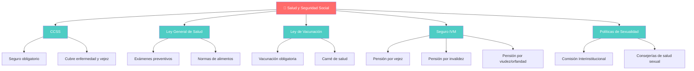
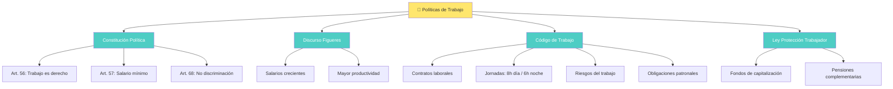
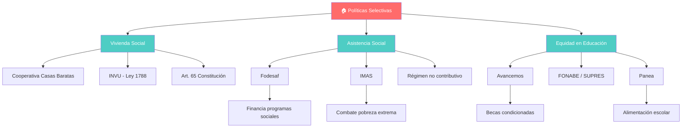
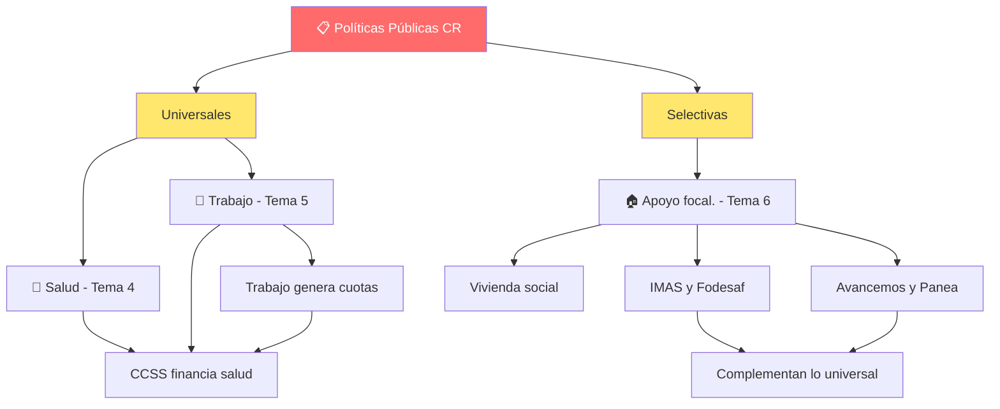

# 📘 Resumen de Estudio — Educación Cívica
### Quinto año · Costa Rica

> Este resumen fue generado a partir del archivo `temas_civica.pdf`. Toda la información proviene exclusivamente de ese documento.

---

## 1. ÍNDICE DE TEMAS

### TEMA 4 — Políticas universales: salud y seguridad social
- 4.1 La salud como derecho universal
- 4.2 Ley de creación de la CCSS
- 4.3 Ley General de la Salud
- 4.4 Ley Nacional de Vacunación
- 4.5 Reglamento del Seguro de Invalidez, Vejez y Muerte
- 4.6 Políticas de sexualidad

### TEMA 5 — Políticas universales: trabajo
- 5.1 Constitución Política (artículos laborales)
- 5.2 Discurso sobre jornales y salarios crecientes
- 5.3 Código de Trabajo
- 5.4 Ley de Protección al Trabajador

### TEMA 6 — Políticas selectivas
- 6.1 Políticas de vivienda social
- 6.2 Políticas de asistencia social y lucha contra la pobreza
- 6.3 Políticas de equidad en educación

---

## 2. RESUMEN POR TEMA

---

### TEMA 4 — Políticas universales: salud y seguridad social

---

#### 4.1 La salud como derecho universal

**¿De qué se trata?**
La salud no es un privilegio, es un derecho que tiene toda persona. La Organización Mundial de la Salud dice que los gobiernos tienen que crear condiciones para que la gente pueda vivir de la forma más saludable posible: acceso a servicios médicos, trabajo seguro, vivienda adecuada y buena alimentación.

**Puntos clave**
- La salud es un derecho universal reconocido internacionalmente.
- Los Estados están obligados a garantizar servicios de salud accesibles.
- Incluye condiciones de trabajo seguro, vivienda adecuada y alimentación nutritiva.
- En Costa Rica, la CCSS es la institución encargada de administrar los seguros sociales.

**Palabras clave**
- **Derecho universal**: Algo que le corresponde a todas las personas sin excepción.
- **OMS**: Organización Mundial de la Salud; define estándares globales de salud.
- **Seguro social obligatorio**: Sistema al que todos los trabajadores deben contribuir.

**¿Por qué importa esto?**
Porque cada vez que vas al EBAIS o a un hospital de la Caja, estás usando un derecho que el país garantiza. Si trabajás o tus papás trabajan, parte de su salario va para que vos y tu familia tengan acceso a atención médica.

**Dato curioso o ejemplo real**
Costa Rica es uno de los pocos países de América Latina donde el seguro social cubre a prácticamente toda la población, incluyendo trabajadores independientes.

---

#### 4.2 Ley de creación de la CCSS

**¿De qué se trata?**
La Caja Costarricense del Seguro Social (CCSS) es una institución autónoma que administra los seguros sociales obligatorios en el país. Es básicamente la encargada de que toda persona tenga acceso a salud y pensiones.

**Puntos clave**
- La CCSS es una institución autónoma (artículo 1).
- El seguro social obligatorio cubre: enfermedad, maternidad, invalidez, vejez y desempleo involuntario (artículo 2).
- Todos los trabajadores que reciban salario deben estar protegidos por el seguro social (artículo 3).
- Los trabajadores independientes deben solicitar afiliación y pagar lo estipulado.
- Si el ingreso del trabajador independiente es menor al salario mínimo, el Estado cubre parcialmente la cuota patronal.

**Palabras clave**
- **CCSS**: Caja Costarricense del Seguro Social; administra la salud pública y pensiones.
- **Institución autónoma**: Funciona de forma independiente del gobierno central.
- **Cuota**: Porcentaje del salario que se paga para mantener el seguro social.

**¿Por qué importa esto?**
Porque la CCSS es la razón por la que podés ir al doctor sin pagar consulta. Tus papás (o vos cuando trabajés) pagan una cuota mensual de su salario para financiar esto.

**Dato curioso o ejemplo real**
La CCSS fue creada en 1941 durante la presidencia de Rafael Ángel Calderón Guardia, como parte de las reformas sociales más importantes de Costa Rica.

---

#### 4.3 Ley General de la Salud

**¿De qué se trata?**
Es la ley que regula todo lo relacionado con la salud en Costa Rica: desde la obligación de los papás de cumplir controles médicos para sus hijos, hasta las normas de los alimentos que se venden en el país.

**Puntos clave**
- Los padres deben cumplir con controles médicos e instrucciones de salud de sus hijos (artículo 14).
- Los alimentos para dieta estudiantil no pueden ser comercializados (artículo 15).
- Todos los estudiantes deben someterse a exámenes médicos y dentales preventivos (artículo 16).
- Los exámenes preventivos y diagnóstico de enfermedades crónicas son un derecho (artículo 17).
- Las personas deben evitar accidentes personales y seguir disposiciones de seguridad (artículo 18).
- Toda persona tiene derecho a información sobre drogas y sustancias en centros de salud (artículo 19).
- Los alimentos para consumo humano deben cumplir normas legales (artículos 196-200).
- Está prohibido importar, elaborar o comercializar alimentos alterados, deteriorados o falsificados (artículo 200).

**Palabras clave**
- **Ley General de la Salud**: Normativa que regula la salud pública en Costa Rica.
- **Exámenes preventivos**: Chequeos médicos para detectar enfermedades a tiempo.
- **Alimento enriquecido**: Producto al que se le agregan nutrientes adicionales.

**¿Por qué importa esto?**
Porque esta ley protege tu salud desde que sos estudiante. Los exámenes médicos en el cole, los comedores escolares y hasta las reglas sobre la comida que comprás en el super están regulados por esta ley.

**Dato curioso o ejemplo real**
El artículo 198 define como "alimento enriquecido" al que se le agregan ingredientes recomendados por normas nutricionales. Eso incluye cosas como la leche fortificada con vitaminas que se vende en el país.

---

#### 4.4 Ley Nacional de Vacunación

**¿De qué se trata?**
Esta ley regula todo lo relacionado con las vacunas en Costa Rica: su selección, compra y disponibilidad en todo el territorio nacional. El objetivo es que el Estado pueda proteger la salud de toda la población.

**Puntos clave**
- La vacunación y revacunación son obligatorias según el esquema del Ministerio de Salud (artículo 150).
- Los padres o tutores deben velar por la vacunación de menores y personas con discapacidad (artículo 151).
- Los certificados de vacunación se deben mostrar cuando un funcionario los pida, pero no pueden ser retenidos (artículo 152).
- Para matricularse en un centro educativo, hay que presentar certificados de vacunación (artículo 153).
- El acceso a vacunación debe ser gratuito y efectivo, especialmente para niñez, inmigrantes y personas en pobreza (artículo 2).
- Las vacunaciones son obligatorias cuando lo decidan el Ministerio de Salud y la CCSS (artículo 3).
- El carné de salud es obligatorio para menores de 7 años (artículo 12).
- Las autoridades deben hacer campañas educativas sobre la importancia de vacunarse (artículo 14).
- Los extranjeros que quieran residir en el país deben presentar certificados de vacunación (artículo 172).

**Palabras clave**
- **Vacunación obligatoria**: Inyecciones que toda persona debe recibir por ley.
- **Carné de salud**: Documento donde se registran las vacunas recibidas.
- **Revacunación**: Dosis de refuerzo de una vacuna ya aplicada.

**¿Por qué importa esto?**
Porque gracias a esta ley, Costa Rica ha logrado eliminar enfermedades que en otros países siguen causando problemas. Cuando te piden el carné de vacunas para la matrícula, es por esta ley.

**Dato curioso o ejemplo real**
Costa Rica fue uno de los primeros países de América Latina en erradicar la poliomielitis gracias a su programa nacional de vacunación.

---

#### 4.5 Reglamento del Seguro de Invalidez, Vejez y Muerte (IVM)

**¿De qué se trata?**
Este reglamento, publicado en 1971, regula las pensiones que da la CCSS a personas que ya no pueden trabajar por vejez, invalidez o a los familiares cuando la persona asegurada fallece.

**Puntos clave**
- Las pensiones por vejez se otorgan a los 65 años con al menos 300 cuotas (artículo 5).
- Con 180 cuotas mínimo, se puede obtener una pensión proporcional (artículo 24).
- La pensión por invalidez es para menores de 65 años declarados inválidos (artículo 6).
- Se considera inválido al que pierda 2/3 o más de su capacidad laboral (artículo 8).
- La pensión por viudez requiere que el cónyuge haya convivido con el fallecido y dependido económicamente (artículo 9).
- La CCSS reconoce derechos para parejas en unión libre (artículo 10).
- La pensión por orfandad es para hijos menores de 18 años (o 25 si son estudiantes) que dependían del asegurado (artículo 12).
- Si el asegurado fallece con al menos 12 cuotas, se da una indemnización (artículo 4).

**Palabras clave**
- **Pensión por vejez**: Pago mensual al jubilarse (65 años, 300 cuotas).
- **Pensión por invalidez**: Pago mensual si no podés trabajar por discapacidad.
- **Pensión por viudez**: Pago mensual al cónyuge sobreviviente.
- **Pensión por orfandad**: Pago mensual a hijos del asegurado fallecido.
- **Cuotas**: Pagos mensuales que se hacen al seguro social.

**¿Por qué importa esto?**
Porque cada vez que alguien trabaja y le rebajan plata del salario para la "Caja", está ahorrando para su pensión futura. Si le pasa algo a esa persona, su familia queda protegida con una pensión.

**Dato curioso o ejemplo real**
Un trabajador que cotice desde los 20 años y trabaje hasta los 65 habrá acumulado más de 540 cuotas, lo cual le garantiza una pensión completa por vejez.

---

#### 4.6 Políticas de sexualidad

**¿De qué se trata?**
El decreto N.º 279135 estableció normativas sobre salud sexual y reproductiva en Costa Rica. Se creó una comisión especial para apoyar al Ministerio de Salud en la formulación de políticas sobre derechos sexuales y reproductivos.

**Puntos clave**
- Se creó la Comisión Interinstitucional sobre Salud y Derechos Reproductivos y Sexuales.
- La comisión da apoyo técnico al Ministerio de Salud en políticas de salud sexual.
- Puede contar con asesoría de la Defensoría de los Habitantes, universidades, la OPS y la OMS.
- Toda institución pública o privada de salud debe tener una "Consejería en Salud y Derechos Reproductivos y Sexuales".
- Las consejerías deben: diseñar campañas educativas, capacitar personal de salud, informar sobre métodos anticonceptivos.
- Para anticoncepción quirúrgica, se requiere consentimiento informado.

**Palabras clave**
- **Derechos reproductivos y sexuales**: Derecho a decidir sobre tu cuerpo y salud sexual.
- **Consentimiento informado**: Aceptación voluntaria tras recibir toda la información necesaria.
- **Consejería en salud**: Servicio de orientación profesional en temas de sexualidad.

**¿Por qué importa esto?**
Porque como adolescente, tenés derecho a recibir información clara y profesional sobre sexualidad en cualquier centro de salud. No es un tema tabú: es un derecho.

**Dato curioso o ejemplo real**
La adolescencia es una etapa clave para preparar un proyecto de vida. Los padres y el Estado deben promover que los jóvenes sean educados en materia de sexualidad, según lo establece el mismo documento.

---

### TEMA 5 — Políticas universales: trabajo

---

#### 5.1 Constitución Política (artículos laborales)

**¿De qué se trata?**
La Constitución Política de Costa Rica establece derechos fundamentales sobre el trabajo en el capítulo de Garantías Sociales. Básicamente, dice que trabajar es un derecho y una obligación, y que el Estado debe asegurar que todos tengan empleo digno.

**Puntos clave**
- El trabajo es un derecho del individuo y una obligación con la sociedad (artículo 56).
- El Estado debe procurar que todos tengan ocupación honesta y remunerada (artículo 56).
- Todo trabajador tiene derecho a un salario mínimo que asegure bienestar y existencia digna (artículo 57).
- No puede haber discriminación salarial entre costarricenses y extranjeros (artículo 68).

**Palabras clave**
- **Garantías sociales**: Derechos laborales y sociales protegidos por la Constitución.
- **Salario mínimo**: Cantidad mínima que un patrono debe pagar por ley.
- **Discriminación salarial**: Pagar diferente por el mismo trabajo según nacionalidad o grupo.

**¿Por qué importa esto?**
Porque cuando empecés a trabajar, tenés derecho a un salario justo y a no ser discriminada. Estos derechos están en la Constitución, que es la ley más importante del país.

**Dato curioso o ejemplo real**
El artículo 56 no solo dice que trabajar es un derecho, sino también una obligación. Esto significa que el Estado ve el trabajo como algo necesario para la sociedad.

---

#### 5.2 Discurso sobre jornales y salarios crecientes

**¿De qué se trata?**
El 2 de noviembre de 1949, José Figueres (presidente de la Junta Fundadora de la Segunda República) dio un discurso llamado "Doctrina social y jornales crecientes". Proponía que los salarios debían subir constantemente para mejorar la economía.

**Puntos clave**
- Figueres proponía una política de salarios crecientes.
- Argumentaba que mejores salarios conducen a mayor eficiencia en los negocios.
- Se abandonan actividades poco productivas y se introducen nuevos métodos técnicos.
- La producción sube tanto en términos globales como por hora de trabajo.
- Se basó en dos premisas: clima de negocios suficiente para pagar mejores sueldos y aumento simultáneo de la productividad.

**Palabras clave**
- **Jornales crecientes**: Salarios que aumentan progresivamente.
- **Productividad**: Cantidad de trabajo efectivo que se produce en un tiempo determinado.
- **Segunda República**: Período de Costa Rica después de la guerra civil de 1948.

**¿Por qué importa esto?**
Porque la idea de que los salarios deben ir subiendo es la base de por qué cada año se revisa el salario mínimo en Costa Rica. Es un concepto que sigue vigente.

**Dato curioso o ejemplo real**
Figueres argumentaba algo contraintuitivo: pagar más a los trabajadores no arruina los negocios, sino que los hace más eficientes porque se eliminan las actividades menos productivas.

---

#### 5.3 Código de Trabajo

**¿De qué se trata?**
Fue aprobado en 1943 y es el documento más importante que regula las relaciones entre patronos y trabajadores en Costa Rica. Cubre desde los contratos de trabajo hasta los salarios, jornadas, riesgos laborales y protecciones especiales.

**Puntos clave**
- El trabajo es un derecho y una obligación de trabajadores y patronos.
- Define los conceptos de patrono, intermediario y trabajador.
- Las órdenes en toda empresa deben ser dadas en español.
- Prohíbe la renuncia a los derechos del Código.
- El contrato puede ser verbal o escrito y debe incluir datos del trabajador, salario y tipo de trabajo.
- La jornada diurna es de 8 horas (5am-7pm) y la nocturna de 6 horas (7pm-5am).
- El salario no puede ser inferior al mínimo de ley y es inembargable excepto por pensión alimenticia (50%).
- El patrono debe proporcionar herramientas, local seguro y pagar salario puntualmente.
- Está prohibido despedir a trabajadoras embarazadas o en período de lactancia sin causa justificada.
- Se considera accidente de trabajo el que ocurre en el trayecto hogar-trabajo.
- El seguro contra riesgos del trabajo es obligatorio y universal (artículo 201).

**Palabras clave**
- **Código de Trabajo**: Ley que regula las relaciones laborales en Costa Rica (1943).
- **Contrato de trabajo**: Acuerdo entre patrono y trabajador sobre las condiciones laborales.
- **Jornada ordinaria**: Horario regular de trabajo (8 horas diurnas, 6 nocturnas).
- **Preaviso**: Aviso anticipado que debe darse antes de terminar un contrato.
- **Cesantía**: Compensación económica al trabajador despedido sin causa justa.
- **Riesgos del trabajo**: Accidentes o enfermedades que ocurren por el trabajo.

**¿Por qué importa esto?**
Porque cuando trabajes, estas reglas te van a proteger. Si te despiden injustamente, si te accidentás en el trabajo, o si no te pagan lo que corresponde, el Código de Trabajo te respalda.

**Dato curioso o ejemplo real**
El Código de Trabajo fue aprobado en 1943, junto con las Garantías Sociales, como parte de las reformas sociales más importantes de la historia de Costa Rica. Antes de eso, existían leyes laborales desde finales del siglo XIX, pero no cubrían a todos los trabajadores.

---

#### 5.4 Ley de Protección al Trabajador

**¿De qué se trata?**
La Ley N.° 7983, publicada en el 2000, creó mecanismos para proteger el dinero de los trabajadores a largo plazo: fondos de capitalización, pensiones complementarias y más formas de asegurar el futuro económico de las personas.

**Puntos clave**
- Regula los fondos de capitalización laboral propiedad de los trabajadores.
- Busca universalizar las pensiones para adultos mayores en pobreza.
- Fortalece el Régimen de Invalidez, Vejez y Muerte de la CCSS.
- Autoriza y regula pensiones complementarias (públicas y privadas).
- Establece mecanismos de supervisión del Sistema Nacional de Pensiones.
- Controla la correcta administración de los recursos de los trabajadores.

**Palabras clave**
- **Fondo de capitalización laboral**: Ahorro forzoso del trabajador que puede retirar en ciertas condiciones.
- **Pensiones complementarias**: Pensiones adicionales al régimen básico de la CCSS.
- **Sistema Nacional de Pensiones**: Conjunto de todos los programas de pensiones del país.

**¿Por qué importa esto?**
Porque parte de tu salario futuro irá a un fondo de ahorro que es tuyo. Cuando cambies de trabajo o te jubilés, ese dinero es tuyo. Es como un ahorro forzado que te protege.

**Dato curioso o ejemplo real**
Gracias a esta ley, cuando un trabajador cambia de empleo puede retirar parte de su fondo de capitalización laboral. Es plata que se acumula mes a mes.

---

### TEMA 6 — Políticas selectivas

---

#### 6.1 Políticas de vivienda social

**¿De qué se trata?**
A diferencia de las políticas universales (para todos), las políticas selectivas van dirigidas a grupos específicos que más lo necesitan. En vivienda, Costa Rica ha tenido programas desde los años 40 para dar casa a familias de escasos recursos.

**Puntos clave**
- De 1940 a 1945 se crearon la Junta Nacional de la Habitación y la Cooperativa de Casas Baratas "La Familia".
- En 1942 el Congreso aprobó la Cooperativa de Casas Baratas para construir casas higiénicas a bajo precio para peones, artesanos y empleados con salario menor a ₡250 al mes.
- Las casas eran inembargables y no se podían alquilar ni vender sin autorización de la Junta Directiva.
- Estaban exentas de impuesto territorial y municipal por 10 años.
- Se financiaban con un impuesto a los espectáculos públicos.
- El artículo 65 de la Constitución Política elevó a precepto constitucional el interés del Estado por la vivienda de interés social.
- En 1954 se creó el Instituto Nacional de Vivienda y Urbanismo (INVU) mediante la Ley 1788.

**Palabras clave**
- **Políticas selectivas**: Acciones del Estado dirigidas a grupos específicos de la población.
- **Vivienda de interés social**: Casas accesibles para familias de bajos recursos.
- **INVU**: Instituto Nacional de Vivienda y Urbanismo.
- **Cooperativa de Casas Baratas**: Programa de vivienda accesible creado en 1942.

**¿Por qué importa esto?**
Porque tener una casa digna es un derecho. Muchas familias en Costa Rica han podido tener su propia casa gracias a estos programas, y el Estado sigue trabajando en esto.

**Dato curioso o ejemplo real**
Las casas de la Cooperativa de Casas Baratas costaban máximo ₡4,000 colones cada una (incluyendo terreno y construcción), y se daban a personas sin propiedad que fueran padres de familia.

---

#### 6.2 Políticas de asistencia social y lucha contra la pobreza

**¿De qué se trata?**
Son programas del Estado para ayudar a familias que no pueden cubrir sus necesidades básicas. El objetivo es reducir la pobreza y dar oportunidades a quienes más lo necesitan.

**Puntos clave**

**Fodesaf (Fondo de Desarrollo Social y Asignaciones Familiares)**
- Creado mediante la Ley 5662 de 1974.
- Beneficia a costarricenses y residentes legales de escasos recursos.
- Financia programas del Ministerio de Salud (nutrición), Ministerio de Educación (comedores escolares), Red de Cuido Infantil.
- Financia el régimen no contributivo de pensiones.
- Da asignación familiar a trabajadores de bajos ingresos con hijos menores de 18 años.

**IMAS (Instituto Mixto de Ayuda Social)**
- Creado por la Ley 4760 del 30 de abril de 1971.
- Su finalidad es resolver el problema de la pobreza extrema.
- Promueve capacitación y financiamiento de ideas productivas para familias pobres.
- Apoya el mejoramiento de viviendas en mal estado.
- Ayuda en situaciones de desastres naturales.
- Brinda aportes económicos para formación técnica y microempresas.

**Régimen no contributivo de la CCSS**
- Creado en 1975, administrado por la CCSS.
- Para personas en estado de necesidad económica.
- Beneficiarios: adultos mayores, personas mayores de 65, personas inválidas, viudas/viudos con hijos, menores huérfanos, personas entre 50 y 65 años imposibilitadas de trabajar.

**Palabras clave**
- **Fodesaf**: Fondo que financia programas sociales contra la pobreza.
- **IMAS**: Instituto que ayuda a familias en pobreza extrema.
- **Régimen no contributivo**: Pensión para personas que nunca cotizaron al seguro social.
- **Pobreza extrema**: Cuando el ingreso es igual o inferior al costo de la canasta básica alimentaria.

**¿Por qué importa esto?**
Porque en Costa Rica el porcentaje de personas pobres se ha mantenido alrededor del 20% desde 1994. Estos programas son la forma en que el Estado intenta reducir esa cifra y ayudar a quienes más lo necesitan.

**Dato curioso o ejemplo real**
Según el Instituto Nacional de Estadística y Censos, las personas se encuentran en pobreza extrema cuando su ingreso es igual o inferior al costo de la canasta básica alimentaria.

---

#### 6.3 Políticas de equidad en educación

**¿De qué se trata?**
Son programas que buscan que todos los jóvenes tengan las mismas oportunidades de estudiar, sin importar su situación económica. Incluyen becas, alimentación escolar y transferencias económicas.

**Puntos clave**

**Programa Avancemos**
- Ejecutado por el IMAS.
- Promueve la permanencia y reinserción de adolescentes en el sistema educativo.
- Es una "transferencia monetaria condicionada": la familia firma un contrato y se compromete a cumplir.
- Beneficiarios deben estar matriculados en educación pública de secundaria.
- Reduce la pobreza, evita el fracaso escolar y previene el trabajo infantil.

**Fondo Nacional de Becas (FONABE)**
- Funcionó entre 1997 y 2020.
- Cerró con la Ley N.° 9903 que unificó las transferencias a estudiantes en el SUPRES (administrado por el IMAS).
- Actualmente, las becas de postsecundaria son un subsidio para estudiantes en pobreza que cursan estudios universitarios.
- El monto depende de la cantidad de materias matriculadas.

**Programa de Alimentación y Nutrición del Escolar y del Adolescente (Panea)**
- Ofrece alimentación complementaria a estudiantes.
- Promueve hábitos alimentarios saludables e higiene.
- No es universal, es focalizado (prioriza familias de bajos ingresos, estudiantes con problemas nutricionales y riesgo psicosocial).
- En algunas zonas, los comedores abren durante vacaciones.
- Criterios para abrir en vacaciones: alta vulnerabilidad social, territorios indígenas, centros con tradición de apertura.

**Palabras clave**
- **Avancemos**: Programa de becas condicionadas para que jóvenes no dejen el colegio.
- **FONABE**: Antiguo fondo de becas (cerró en 2020).
- **SUPRES**: Sistema Único de Pagos Sociales, administrado por el IMAS.
- **Panea**: Programa de alimentación escolar focalizado.
- **Transferencia monetaria condicionada**: Dinero que se da a cambio de cumplir compromisos.

**¿Por qué importa esto?**
Porque si vos o alguno de tus compañeros necesitan apoyo económico para seguir estudiando, estos programas existen para eso. Avancemos, por ejemplo, da plata a las familias para que los jóvenes no dejen el cole.

**Dato curioso o ejemplo real**
FONABE cerró en 2020 porque la Ley N.° 9903 decidió unificar todas las becas en un solo sistema (SUPRES) administrado por el IMAS, para evitar que diferentes instituciones dieran ayudas duplicadas.

---

## 3. CONEXIONES ENTRE TEMAS

### ¿Cómo se relacionan los tres temas?

Imaginá que el bienestar de las personas es como una mesa con tres patas:

1. **Pata 1 — Salud (Tema 4)**: Si estás sana, podés estudiar y trabajar.
2. **Pata 2 — Trabajo (Tema 5)**: Si trabajás, generás ingresos para vivir y pagás el seguro social que financia la salud.
3. **Pata 3 — Apoyo a los más necesitados (Tema 6)**: No todos parten del mismo punto. Las políticas selectivas nivelan la cancha para que todos tengan las mismas oportunidades.

**Conexiones específicas:**

- La **CCSS** (Tema 4) se financia con las **cuotas de los trabajadores** (Tema 5). Sin trabajo formal, no hay dinero para la salud pública.
- El **Código de Trabajo** (Tema 5) obliga a los patronos a asegurar a sus empleados, lo cual conecta directamente con el **seguro social** (Tema 4).
- El **IMAS y Avancemos** (Tema 6) ayudan a que jóvenes sigan estudiando, lo cual eventualmente les permite conseguir **mejor empleo** (Tema 5) y acceder a **mejor salud** (Tema 4).
- **Fodesaf** (Tema 6) financia programas del **Ministerio de Salud** (Tema 4) y del **Ministerio de Educación** (Tema 6), conectando la lucha contra la pobreza con la salud y la educación.
- El **Régimen no contributivo** (Tema 6) existe para personas que no pudieron contribuir al sistema de **pensiones** (Tema 4/5), demostrando que las políticas selectivas complementan a las universales.

**Frase para recordar:**
> "Las políticas universales protegen a todos; las selectivas ayudan a quienes el sistema universal no alcanza."

---

## 4. MAPAS CONCEPTUALES

### Mapa Conceptual — Tema 4: Salud y Seguridad Social

### Mapa Conceptual — Tema 5: Trabajo

### Mapa Conceptual — Tema 6: Políticas Selectivas

### Mapa Conceptual — Conexión entre los 3 Temas

---

## 5. GUÍA RÁPIDA DE REPASO (Cheat Sheet)

| Tema | Institución/Ley | Año | Función principal |
|------|-----------------|-----|-------------------|
| Salud | CCSS | 1941 | Administra seguros sociales obligatorios |
| Salud | Ley General de Salud | — | Regula salud pública, alimentos, exámenes |
| Salud | Ley Nacional de Vacunación | — | Vacunación obligatoria y gratuita |
| Salud | Reglamento IVM | 1971 | Pensiones por vejez, invalidez y muerte |
| Salud | Políticas sexualidad | — | Derechos reproductivos y sexuales |
| Trabajo | Constitución Política | 1949 | Arts. 56, 57, 68: derecho al trabajo |
| Trabajo | Discurso Figueres | 1949 | Doctrina de salarios crecientes |
| Trabajo | Código de Trabajo | 1943 | Regula relaciones patrono-trabajador |
| Trabajo | Ley Protección Trabajador | 2000 | Fondos de capitalización y pensiones |
| Selectivas | Cooperativa Casas Baratas | 1942 | Vivienda accesible para familias pobres |
| Selectivas | INVU | 1954 | Vivienda y urbanismo |
| Selectivas | Fodesaf | 1974 | Financia programas contra la pobreza |
| Selectivas | IMAS | 1971 | Combate la pobreza extrema |
| Selectivas | Régimen no contributivo | 1975 | Pensión para quienes no cotizaron |
| Selectivas | Avancemos | — | Becas condicionadas para secundaria |
| Selectivas | FONABE / SUPRES | 1997-2020 | Becas estudiantiles (unificadas en IMAS) |
| Selectivas | Panea | — | Alimentación escolar focalizada |

### Datos rápidos para recordar:
- **Jornada diurna**: 8 horas (5am-7pm)
- **Jornada nocturna**: 6 horas (7pm-5am)
- **Pensión por vejez**: 65 años + 300 cuotas
- **Pensión proporcional**: 65 años + 180 cuotas mínimo
- **Salario**: Inembargable excepto pensión alimenticia (50%)
- **Pobreza en CR**: ~20% desde 1994
- **Pobreza extrema**: Ingreso ≤ canasta básica alimentaria

---

## 6. PREGUNTAS DE ESTUDIO

---

### TEMA 4 — Salud y Seguridad Social

#### a) Selección única

**1. ¿Cuál es la principal función de la CCSS según su artículo 1?**
- A) Regular el comercio de alimentos
- B) Administrar los seguros sociales obligatorios en el país ✅
- C) Gestionar los hospitales privados
- D) Controlar la vacunación de animales

**Explicación:** La CCSS es una institución autónoma cuya función principal es administrar los seguros sociales obligatorios.

---

**2. Según el artículo 2, ¿cuáles riesgos cubre el seguro social obligatorio?**
- A) Solo enfermedad y vejez
- B) Enfermedad, maternidad, invalidez, vejez y desempleo involuntario ✅
- C) Solo accidentes de trabajo
- D) Enfermedad y educación

**Explicación:** El artículo 2 establece que cubre enfermedad, maternidad, invalidez, vejez y desempleo involuntario.

---

**3. ¿Qué establece el artículo 16 de la Ley General de la Salud?**
- A) Que los estudiantes pueden elegir si hacerse exámenes médicos
- B) Que solo los estudiantes de primaria deben hacerse exámenes
- C) Que todos los estudiantes deben someterse a exámenes médicos y dentales preventivos ✅
- D) Que los exámenes médicos son opcionales en escuelas privadas

**Explicación:** El artículo 16 obliga a todos los estudiantes a realizarse exámenes médicos y dentales preventivos en centros educativos públicos y privados.

---

**4. ¿Qué documento es obligatorio presentar al matricularse en un centro educativo?**
- A) Certificado de notas del año anterior
- B) Certificado de vacunación ✅
- C) Certificado de nacimiento únicamente
- D) Carné de la biblioteca

**Explicación:** El artículo 153 de la Ley General de Salud establece la obligatoriedad de presentar certificados de vacunación en el proceso de matrícula.

---

**5. ¿Cuántas cuotas mínimas se necesitan para obtener la pensión por vejez completa?**
- A) 180 cuotas
- B) 240 cuotas
- C) 300 cuotas ✅
- D) 360 cuotas

**Explicación:** El artículo 5 del Reglamento IVM indica que se necesitan al menos 300 cuotas con 65 años de edad.

---

**6. ¿Qué se considera inválido según el artículo 8 del Reglamento IVM?**
- A) Quien pierda un tercio de su capacidad laboral
- B) Quien pierda dos terceras partes o más de su capacidad laboral ✅
- C) Quien tenga más de 65 años
- D) Quien no tenga empleo por más de un año

**Explicación:** Se considera inválido al asegurado que pierda 2/3 o más de su capacidad de desempeño laboral.

---

**7. ¿Quiénes tienen derecho a pensión por orfandad?**
- A) Solo hijos menores de 15 años
- B) Hijos solteros menores de 18 años o menores de 25 si son estudiantes ✅
- C) Solo hijos biológicos reconocidos
- D) Todos los familiares del asegurado fallecido

**Explicación:** El artículo 12 indica que la pensión por orfandad es para hijos menores de 18 o menores de 25 si son estudiantes, que dependían del asegurado.

---

**8. ¿Qué organismo se creó con las políticas de sexualidad?**
- A) Ministerio de la Juventud
- B) Comisión Interinstitucional sobre Salud y Derechos Reproductivos y Sexuales ✅
- C) Defensoría de la Mujer
- D) Instituto de la Familia

**Explicación:** El decreto creó la Comisión Interinstitucional sobre Salud y Derechos Reproductivos y Sexuales para dar apoyo técnico al Ministerio de Salud.

---

**9. ¿Qué artículo de la Ley General de Salud prohíbe comercializar alimentos de la dieta estudiantil?**
- A) Artículo 14
- B) Artículo 15 ✅
- C) Artículo 16
- D) Artículo 17

**Explicación:** El artículo 15 establece que los alimentos entregados a instituciones para complementar la dieta estudiantil no pueden ser comercializados.

---

**10. ¿Qué pasa si un trabajador independiente gana menos del salario mínimo legal?**
- A) No puede afiliarse a la CCSS
- B) Debe pagar la cuota completa de todas formas
- C) El Estado cubre parcialmente la ausencia de la cuota patronal ✅
- D) Queda exento de todo pago

**Explicación:** El artículo 3 establece que si el ingreso del trabajador independiente es menor al salario mínimo legal, el aporte del Estado cubrirá parcialmente la ausencia de la cuota patronal.

---

#### b) Verdadero/Falso

**1. La vacunación en Costa Rica es voluntaria según la ley.** ❌ FALSO
La vacunación es obligatoria según el artículo 150 de la Ley General de Salud.

**2. Los funcionarios de salud pueden retener los certificados de vacunación.** ❌ FALSO
El artículo 152 establece que los funcionarios no podrán retener dichos certificados.

**3. La pensión por viudez se otorga al cónyuge sobreviviente que dependía económicamente del fallecido.** ✅ VERDADERO

**4. La CCSS reconoce derechos de pensión solo para parejas casadas legalmente.** ❌ FALSO
El artículo 10 indica que la CCSS reconoce derechos para la pareja del asegurado, sea en matrimonio o en unión libre.

**5. Los extranjeros que quieran residir en Costa Rica no necesitan certificados de vacunación.** ❌ FALSO
El artículo 172 plantea la obligación de entregar certificados de vacunación junto a la solicitud de residencia.

**6. Las personas tienen derecho a obtener información sobre drogas en los centros de salud.** ✅ VERDADERO
Según el artículo 19 de la Ley General de la Salud.

**7. La pensión por vejez se puede obtener a los 60 años con 300 cuotas.** ❌ FALSO
La edad requerida es 65 años según el artículo 5 del Reglamento IVM.

---

#### c) Pareos/Emparejamiento

**Conjunto 1**

| Columna A (Concepto) | Columna B (Definición) |
|---|---|
| 1. CCSS | a. Pensión para quienes pierden 2/3 de su capacidad laboral |
| 2. Pensión por invalidez | b. Documento para registrar vacunas de menores de 7 años |
| 3. Carné de salud | c. Institución que administra seguros sociales obligatorios |
| 4. Alimento enriquecido | d. Producto al que se le agregan nutrientes adicionales |

**Respuestas:** 1-c, 2-a, 3-b, 4-d

**Conjunto 2**

| Columna A (Artículo) | Columna B (Contenido) |
|---|---|
| 1. Artículo 150 | a. Exámenes médicos y dentales obligatorios para estudiantes |
| 2. Artículo 16 | b. Prohibición de comercializar alimentos de la dieta estudiantil |
| 3. Artículo 15 | c. Vacunación y revacunación obligatoria |
| 4. Artículo 200 | d. Prohibición de alimentos alterados o falsificados |

**Respuestas:** 1-c, 2-a, 3-b, 4-d

**Conjunto 3**

| Columna A (Tipo de pensión) | Columna B (Requisito) |
|---|---|
| 1. Pensión por vejez | a. Cónyuge que convivía y dependía del fallecido |
| 2. Pensión por viudez | b. 65 años y 300 cuotas mínimo |
| 3. Pensión por orfandad | c. Menor de 65 años declarado inválido |
| 4. Pensión por invalidez | d. Hijos menores de 18 o estudiantes menores de 25 |

**Respuestas:** 1-b, 2-a, 3-d, 4-c

---

### TEMA 5 — Trabajo

#### a) Selección única

**1. Según el artículo 56 de la Constitución, el trabajo es:**
- A) Solo un derecho del individuo
- B) Solo una obligación con la sociedad
- C) Un derecho del individuo y una obligación con la sociedad ✅
- D) Un privilegio para ciudadanos costarricenses

**Explicación:** El artículo 56 establece que el trabajo es tanto un derecho como una obligación social.

---

**2. ¿Cuántas horas dura la jornada diurna ordinaria según el Código de Trabajo?**
- A) 6 horas
- B) 7 horas
- C) 8 horas ✅
- D) 10 horas

**Explicación:** La jornada diurna ordinaria es de 8 horas, realizada entre las 5 y las 19 horas.

---

**3. ¿En qué año fue aprobado el Código de Trabajo de Costa Rica?**
- A) 1941
- B) 1943 ✅
- C) 1949
- D) 1971

**Explicación:** El Código de Trabajo fue aprobado en 1943.

---

**4. ¿Qué proponía José Figueres en su discurso de 1949?**
- A) Reducir los salarios para atraer inversión
- B) Mantener los salarios estáticos
- C) Una política de salarios crecientes ✅
- D) Eliminar el salario mínimo

**Explicación:** Figueres proponía la "Doctrina social y jornales crecientes", argumentando que mejores salarios aumentan la productividad.

---

**5. ¿Qué porcentaje del salario puede embargarse por pensión alimenticia?**
- A) 25%
- B) 30%
- C) 50% ✅
- D) 75%

**Explicación:** El salario es inembargable excepto por pensión alimenticia, donde el embargo puede ser del 50%.

---

**6. ¿Cuál situación NO se considera accidente de trabajo según el artículo 199?**
- A) Accidente en el trayecto hogar-trabajo
- B) Accidente por acatar órdenes del patrono fuera del horario
- C) Accidente provocado intencionalmente por el trabajador ✅
- D) Accidente durante una paralización en la jornada laboral

**Explicación:** No se consideran riesgos del trabajo los provocados intencionalmente ni los que ocurren bajo efectos del licor o drogas ilegales.

---

**7. ¿Qué establece la Ley de Protección al Trabajador sobre los fondos de capitalización?**
- A) Son propiedad del patrono
- B) Son propiedad del Estado
- C) Son propiedad de los trabajadores ✅
- D) Son propiedad de la CCSS

**Explicación:** La ley establece el marco para regular los fondos de capitalización laboral que son propiedad de los trabajadores.

---

**8. ¿Qué artículo prohíbe al patrono despedir a trabajadoras embarazadas sin causa justificada?**
- A) Una prohibición general del Código de Trabajo ✅
- B) Un artículo de la Constitución
- C) Una norma del IMAS
- D) Una regla del Ministerio de Salud

**Explicación:** El Código de Trabajo prohíbe despedir a trabajadoras en estado de embarazo o período de lactancia sin causa justificada comprobada ante el Ministerio de Trabajo.

---

**9. ¿Qué horario comprende el trabajo nocturno?**
- A) De las 6pm a las 6am
- B) De las 7pm a las 5am ✅
- C) De las 8pm a las 4am
- D) De las 9pm a las 5am

**Explicación:** El trabajo nocturno se realiza entre las 19 horas (7pm) y las 5 horas (5am).

---

**10. ¿En qué idioma deben darse las órdenes en toda empresa según el Código de Trabajo?**
- A) En el idioma del patrono
- B) En inglés o español
- C) En español ✅
- D) En cualquier idioma oficial

**Explicación:** El Código de Trabajo propone que las órdenes en toda empresa o institución de trabajo deben ser dadas en español.

---

#### b) Verdadero/Falso

**1. El contrato de trabajo solo puede ser escrito.** ❌ FALSO
Según el Código de Trabajo, el contrato puede ser verbal o escrito.

**2. La jornada extraordinaria más la ordinaria no pueden exceder las 12 horas.** ✅ VERDADERO

**3. El artículo 68 de la Constitución permite la discriminación salarial entre nacionales y extranjeros.** ❌ FALSO
El artículo 68 prohíbe la discriminación salarial entre costarricenses y extranjeros.

**4. Los patronos pueden obligar a los trabajadores a comprar en determinados establecimientos.** ❌ FALSO
Esto está expresamente prohibido en el Código de Trabajo.

**5. El seguro contra riesgos del trabajo es obligatorio y universal según el artículo 201.** ✅ VERDADERO

**6. Un accidente ocurrido en el trayecto del hogar al trabajo siempre se considera accidente de trabajo.** ❌ FALSO
Solo se considera accidente de trabajo en el trayecto cuando el patrono costea el transporte o el acceso al lugar presenta un riesgo especial.

**7. El salario mínimo se fija una sola vez y no cambia.** ❌ FALSO
El artículo 57 establece que el salario mínimo es de fijación periódica.

---

#### c) Pareos/Emparejamiento

**Conjunto 1**

| Columna A (Concepto) | Columna B (Definición) |
|---|---|
| 1. Preaviso | a. Compensación por despido injustificado |
| 2. Cesantía | b. Retribución que el patrono paga al trabajador |
| 3. Salario | c. Aviso anticipado antes de terminar un contrato |
| 4. Jornada mixta | d. Combinación de horas diurnas y nocturnas (máx. 8h) |

**Respuestas:** 1-c, 2-a, 3-b, 4-d

**Conjunto 2**

| Columna A (Artículo constitucional) | Columna B (Contenido) |
|---|---|
| 1. Artículo 56 | a. Salario mínimo de fijación periódica |
| 2. Artículo 57 | b. No discriminación salarial |
| 3. Artículo 68 | c. Trabajo: derecho y obligación |

**Respuestas:** 1-c, 2-a, 3-b

**Conjunto 3**

| Columna A (Ley/Código) | Columna B (Año de aprobación) |
|---|---|
| 1. Código de Trabajo | a. 2000 |
| 2. Discurso de Figueres | b. 1943 |
| 3. Ley de Protección al Trabajador | c. 1949 |

**Respuestas:** 1-b, 2-c, 3-a

---

### TEMA 6 — Políticas Selectivas

#### a) Selección única

**1. ¿Qué son las políticas selectivas?**
- A) Políticas que benefician a toda la población
- B) Acciones dirigidas a un sector específico de la población para que accedan a los beneficios universales ✅
- C) Políticas que solo aplican a empleados públicos
- D) Leyes que regulan las elecciones

**Explicación:** Las políticas selectivas son acciones del Estado para proveer servicios a un sector específico y lograr que accedan a los beneficios de las políticas universales.

---

**2. ¿En qué año se creó la Cooperativa de Casas Baratas?**
- A) 1940
- B) 1942 ✅
- C) 1945
- D) 1954

**Explicación:** El 13 de agosto de 1942, el Congreso de la República aprobó su creación.

---

**3. ¿Cuál es la finalidad principal del IMAS?**
- A) Administrar los seguros sociales
- B) Regular el comercio
- C) Resolver el problema de la pobreza extrema ✅
- D) Gestionar la educación pública

**Explicación:** La finalidad del IMAS es resolver el problema de la pobreza extrema en el país.

---

**4. ¿Qué ley creó el Fodesaf?**
- A) Ley 4760
- B) Ley 5662 ✅
- C) Ley 7983
- D) Ley 9903

**Explicación:** El Fodesaf fue creado mediante la Ley 5662 de 1974.

---

**5. ¿Qué es el Programa Avancemos?**
- A) Un programa de vacunación
- B) Un programa de vivienda social
- C) Una transferencia monetaria condicionada para que jóvenes no abandonen el colegio ✅
- D) Un programa de pensiones para adultos mayores

**Explicación:** Avancemos es una transferencia monetaria condicionada que promueve la permanencia de adolescentes en el sistema educativo.

---

**6. ¿Por qué cerró el FONABE en 2020?**
- A) Porque no tenía fondos
- B) Porque la Ley N.° 9903 unificó las transferencias en el SUPRES administrado por el IMAS ✅
- C) Porque fue declarado inconstitucional
- D) Porque cumplió su objetivo

**Explicación:** La Ley N.° 9903 unificó las transferencias monetarias a estudiantes en el SUPRES para evitar duplicidades.

---

**7. ¿Qué criterio NO se usa para priorizar beneficiarios del Panea?**
- A) Familias con ingreso económico bajo
- B) Estudiantes con problemas nutricionales
- C) Estudiantes con las mejores calificaciones ✅
- D) Estudiantes con sospecha de riesgo psicosocial

**Explicación:** Los criterios del Panea son: ingreso bajo, problemas nutricionales y riesgo psicosocial. Las calificaciones no son criterio.

---

**8. ¿Qué artículo de la Constitución elevó a precepto constitucional la vivienda de interés social?**
- A) Artículo 56
- B) Artículo 65 ✅
- C) Artículo 68
- D) Artículo 72

**Explicación:** El artículo 65 de la Constitución Política elevó a precepto constitucional el interés del Estado por la vivienda de interés social.

---

**9. ¿Quiénes pueden ser beneficiarios del régimen no contributivo de la CCSS?**
- A) Solo personas mayores de 65 años
- B) Solo personas inválidas
- C) Personas en estado de necesidad económica que pertenezcan a grupos vulnerables ✅
- D) Todos los costarricenses sin excepción

**Explicación:** Los beneficiarios incluyen adultos mayores, personas inválidas, viudas/os con hijos, huérfanos y personas entre 50 y 65 que no pueden trabajar.

---

**10. ¿Cuánto ha permanecido el porcentaje de personas pobres en Costa Rica desde 1994?**
- A) Alrededor del 10%
- B) Alrededor del 15%
- C) Alrededor del 20% ✅
- D) Alrededor del 30%

**Explicación:** Según el documento, el porcentaje de personas pobres se ha mantenido alrededor del 20% desde 1994.

---

#### b) Verdadero/Falso

**1. Las políticas selectivas benefician a toda la población por igual.** ❌ FALSO
Las políticas selectivas se dirigen a un sector específico de la población, a diferencia de las universales.

**2. El IMAS fue creado en 1971 según la Ley 4760.** ✅ VERDADERO

**3. Las casas de la Cooperativa de Casas Baratas se podían alquilar libremente.** ❌ FALSO
Se impedía al propietario alquilar, gravar o enajenar la propiedad sin autorización de la Junta Directiva.

**4. El Panea es un programa universal que cubre a todos los estudiantes.** ❌ FALSO
El Panea no es universal sino de carácter social focalizado, priorizando a los más necesitados.

**5. El Fodesaf financia el régimen no contributivo de pensiones.** ✅ VERDADERO

**6. Avancemos es ejecutado por el Ministerio de Educación.** ❌ FALSO
Avancemos es ejecutado por el IMAS, no por el Ministerio de Educación.

**7. El INVU fue creado en 1954 mediante la Ley 1788.** ✅ VERDADERO

---

#### c) Pareos/Emparejamiento

**Conjunto 1**

| Columna A (Institución/Programa) | Columna B (Función) |
|---|---|
| 1. IMAS | a. Financia programas sociales contra la pobreza |
| 2. Fodesaf | b. Alimentación complementaria escolar |
| 3. Panea | c. Resuelve pobreza extrema |
| 4. Avancemos | d. Beca condicionada para secundaria |

**Respuestas:** 1-c, 2-a, 3-b, 4-d

**Conjunto 2**

| Columna A (Institución) | Columna B (Año de creación) |
|---|---|
| 1. Cooperativa Casas Baratas | a. 1975 |
| 2. INVU | b. 1942 |
| 3. IMAS | c. 1954 |
| 4. Régimen no contributivo | d. 1971 |

**Respuestas:** 1-b, 2-c, 3-d, 4-a

**Conjunto 3**

| Columna A (Programa) | Columna B (Característica) |
|---|---|
| 1. Avancemos | a. Cerró en 2020 y se unificó en SUPRES |
| 2. FONABE | b. Abre comedores en vacaciones en zonas vulnerables |
| 3. Panea | c. Familia firma contrato y se compromete |
| 4. Régimen no contributivo | d. Para personas que nunca cotizaron |

**Respuestas:** 1-c, 2-a, 3-b, 4-d
